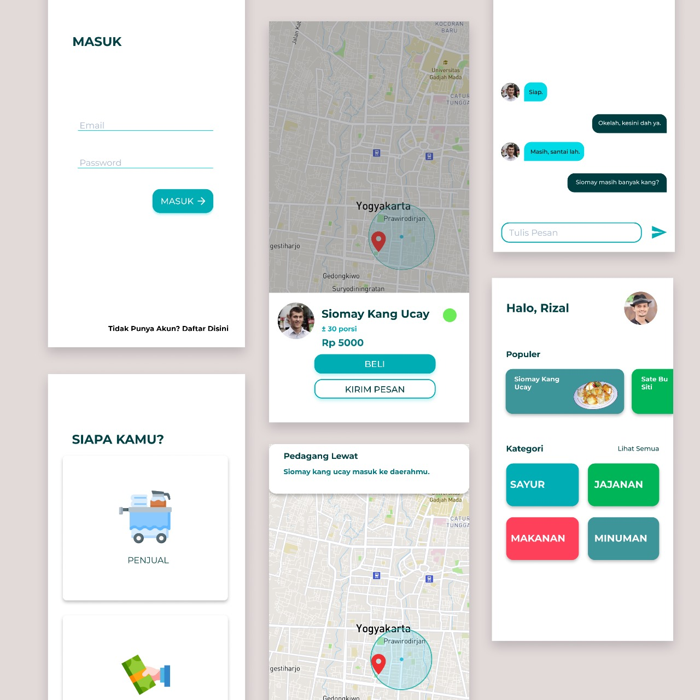

    <h1>Gokil App</h1>

## Table of Contents

- [Table of Contents](#Table-of-Contents)
- [Introduction](#Introduction)
- [Features](#Features)
- [Requirements](#Requirements)
- [Usage](#Usage)
- [Screenshot](#Screenshot)
- [Related Project](#Related-Project)
- [Contributors](#Contributors)

## Introduction

Gokel App is application for buyer and seller, buyer will get a notification when seller's location is in nearby and both buyer and seller are able to chat each other

## Features

- Notification when seller is in around

## Requirements

- `npm`
- `react-native-cli`
- [Backend]()

## Usage

- Clone or download this repo first
- Open your terminal or cmd and type `npm install` and `react-native link`
- After that, run backend first
- Connect your phone to the pc or laptop and make sure your phone is connected with debugging mode
- Finnaly, type `react-native run-android` and wait for the process to complete

## Screenshoot

  
## Related Project
 
* In this repository only for the frontend section, for the backend section can be seen [here]().

## Contributors

  <table>
    <tr>
      <td align="center">
        <a href="https://github.com/ayiangio">
           
          <b>Moh abdul haris angio</b>
        </a>
      </td>
      <td align="center">
        <a href="https://github.com/Drzaln">
           
          <b>Doddy Rizal Novianto</b>
        </a>
      </td>
      <td align="center">
        <a href="https://github.com/abdillahtop">
           
          <b>Abdillah Dzulfikar Mustanir</b>
        </a>
      </td>
      <td align="center">
        <a href="https://github.com/bimtut">
           
          <b>Bima Ketut Ramuna Putra</b>
        </a>
      </td>
      <td align="center">
        <a href="https://github.com/Khusnijafar">
           
          <b>Khusni Jafar</b>
        </a>
      </td>
    </tr>
  </table>

